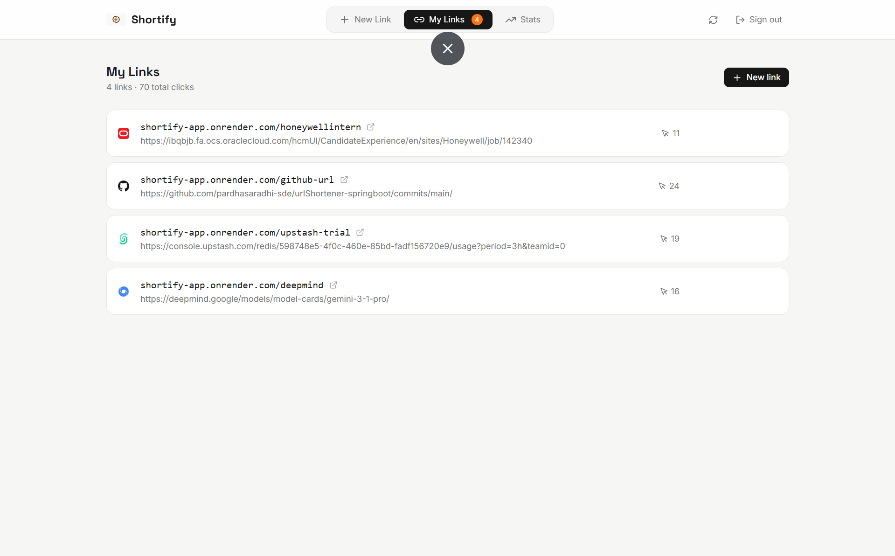
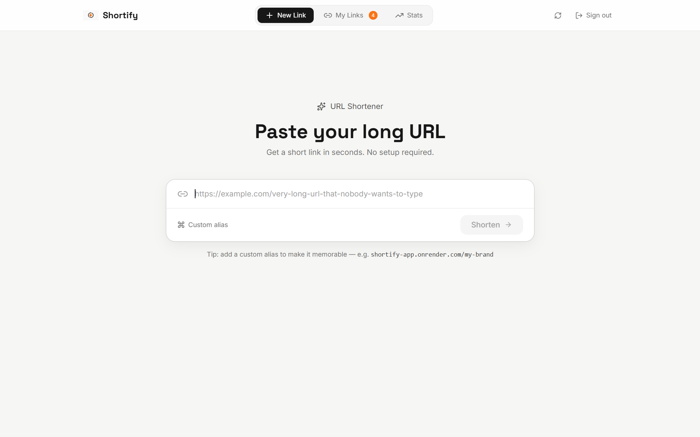
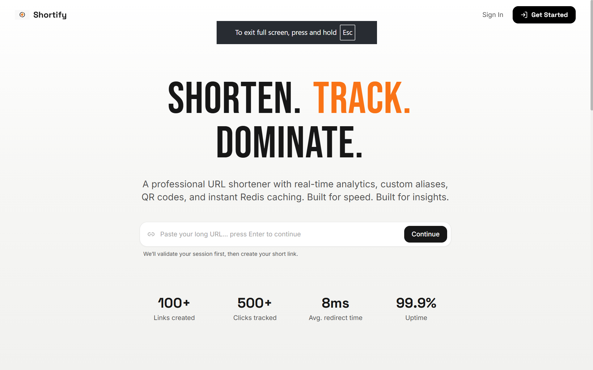

# Shortify - Real-Time URL Intelligence Platform
> Try the app first: https://shortify-now.vercel.app/
>
> Most URL shorteners stop at redirection.
> Shortify goes further by turning every click into actionable analytics.

---

## What Is This?

Most URL shorteners are treated as utility tools: generate a short link, share it, and move on.

**Shortify is a production-focused URL platform that combines fast redirects with real-time analytics so users can understand link performance, audience behavior, and traffic trends.**

Here is what it does:

1. **Creates secure short links** - Generate compact 8-character codes with optional custom aliases.
2. **Redirects at high speed** - Optimized redirect path using Redis caching ensures sub-10ms latency for most requests.
3. **Tracks engagement in real time** - Captures total clicks, unique visitors, browser and OS breakdowns, and 30-day trends.
4. **Keeps redirects fast under load** - Click recording happens asynchronously after the 302 response is sent.
5. **Improves sharing workflows** - Generates downloadable QR codes for every short URL.

---

## Why I Built This

I wanted to go beyond a basic URL shortener and build a system that focuses on performance, scalability, and real-time analytics - similar to production systems used at scale.

---

## 📸 Preview

| Dashboard | Analytics Charts |
|---|---|
|  |  |

| QR UI | Landing |
|---|---|
|  |  |

---

## Who Is It For?

| User Type | What They Get |
|---|---|
| Content Creators / Marketers | Shareable short links, campaign-level click visibility, traffic trends |
| Product Teams / Founders | Fast redirect infrastructure, analytics-backed link decisions |
| Developers | A full-stack, production-style URL system with auth, caching, async events, and rate limiting |

---

## Architecture

Shortify is a full-stack distributed web system where redirect performance is isolated from analytics persistence.

```
┌────────────────────────────────────────────────────────────┐
│                       User Browser                          │
│               React 19 Frontend (Vite 7)                    │
└────────────────────────┬───────────────────────────────────┘
             │  HTTPS + JWT Bearer
             ▼
┌────────────────────────────────────────────────────────────┐
│                Spring Boot Backend :8080                   │
│    Auth · URL CRUD · Redirect · Analytics · QR APIs        │
│      JwtAuthFilter · RateLimitInterceptor · @Async         │
└──────────┬──────────────────────────┬──────────────────────┘
       │  JDBC                    │  Redis protocol
       ▼                          ▼
  ┌─────────────┐           ┌─────────────────────────────┐
  │ PostgreSQL  │           │ Redis 7                     │
  │ users       │           │ URL cache (24h TTL)         │
  │ short_urls  │           │ Sliding-window counters     │
  │ click_events│           │ Rate-limit state            │
  └─────────────┘           └─────────────────────────────┘
```

### Key Design Decisions

| Decision | Why |
|---|---|
| Async click pipeline | Redirect returns immediately; click analytics are recorded in background via Spring events + `@Async` listener |
| Redis-first redirect path | Hot short-code lookups avoid DB round trips and keep redirect latency consistently low |
| Owner-scoped URL data model | Every URL record is tied to a user, preventing cross-account access by design |
| Sliding-window limiter in Redis | Enforces predictable behavior under load with separate limits for URL creation, redirects, and general API usage |
| DTO-only API boundary | Internal JPA entities never leak into public responses, keeping contracts stable and safer |
| Flyway-driven schema control | Versioned migrations keep local/dev/prod schemas consistent over time |

---

## Features

### For Users
- Create short URLs with optional custom aliases
- Open a personal dashboard with all created links
- View analytics: total clicks, unique visitors, browser share, OS share, and daily trend
- Generate QR codes for each short URL and download them instantly
- Delete links you own from the dashboard

### Performance and Scale
- Optimized redirect path using Redis caching ensures sub-10ms latency for most requests
- Async click ingestion keeps the redirect critical path non-blocking
- Redis-backed sliding-window rate limiting protects APIs and redirect endpoints
- Cache invalidation on delete ensures stale links are not served

### Security and Reliability
- JWT authentication with stateless Spring Security flow
- BCrypt password hashing
- CORS restrictions via environment configuration
- Owner-only access checks on URL resource operations
- Flyway migrations on startup with schema validation

---

## Tech Stack

| Layer | Technology | Notes |
|---|---|---|
| Frontend | React 19 + Vite 7 | SPA with dashboard and auth pages |
| Frontend | React Router v7 | Protected and guest route flows |
| Frontend | Tailwind CSS v3 | Utility-first styling |
| Frontend | Recharts 3 | Analytics visualizations |
| Frontend | Framer Motion 12 | UI transitions and motion effects |
| Backend | Java 21 + Spring Boot 3.4 | Core API runtime |
| Backend | Spring Security + JJWT 0.12 | JWT auth and authorization |
| Backend | Spring Data JPA + Hibernate | Persistence layer |
| Backend | PostgreSQL | Primary relational database |
| Backend | Redis 7 (Lettuce) | Caching + rate-limit state |
| Backend | Flyway | Versioned SQL migrations |
| Backend | ZXing 3.5 | QR code generation |
| Build | Maven + npm | Backend and frontend build pipelines |

---

## Project Structure

```
urlshortener/
├── docker-compose.yml
├── backend/
│   ├── src/main/java/com/example/url_shortener/
│   │   ├── controller/             # Auth, URL, Redirect, Analytics, QR, Cache admin
│   │   ├── service/                # URL, Analytics, Auth, QR, Rate limit services
│   │   ├── events/                 # ClickRecordedEvent + async listener
│   │   ├── model/                  # User, ShortUrl, ClickEvent
│   │   ├── repository/             # JPA repositories and analytics queries
│   │   ├── dtos/                   # Request/response contracts
│   │   ├── security/               # JWT utilities and auth filter
│   │   ├── config/                 # Security, Redis, rate limiting
│   │   └── exception/              # Global API exception handling
│   └── src/main/resources/
│       ├── application.yml
│       ├── application-prod.yml
│       └── db/migration/           # Flyway SQL files (V1-V6)
└── frontend/
  ├── public/demoimages/          # README preview images
  └── src/
    ├── pages/
    │   ├── landing/
    │   ├── dashboard/
    │   ├── login/
    │   └── register/
    ├── components/
    │   ├── layout/
    │   └── ui/
    ├── context/AuthContext.jsx
    └── services/api.js
```

---

## Prerequisites

| Requirement | Version |
|---|---|
| Node.js | 20+ |
| Java | 21 |
| Maven | 3.9+ |
| PostgreSQL | 15+ |
| Redis | 7+ |
| Docker Desktop | Latest |

---

## Getting Started

### 1. Clone

```bash
git clone https://github.com/<your-username>/urlshortener.git
cd urlshortener
```

### 2. Set up PostgreSQL

```sql
CREATE DATABASE url_shortener;
```

### 3. Start with Docker Compose

```bash
docker compose up -d
```

Frontend: http://localhost:5173
Backend: http://localhost:8080

### 4. Run without Docker (optional)

```bash
# Terminal 1 - backend
cd backend
mvn spring-boot:run

# Terminal 2 - frontend
cd frontend
npm install
npm run dev
```

---

## Environment Variables

### Frontend (`frontend/.env`)

| Variable | Required | Example | Description |
|---|---|---|---|
| `VITE_API_URL` | Yes | `http://localhost:8080` | Base URL for the backend API |

### Backend

| Variable | Required | Example | Description |
|---|---|---|---|
| `DB_URL` | Yes | `jdbc:postgresql://localhost:5432/url_shortener` | PostgreSQL JDBC URL |
| `DB_USERNAME` | Yes | `postgres` | PostgreSQL username |
| `DB_PASSWORD` | Yes | `your_password` | PostgreSQL password |
| `REDIS_HOST` | Yes | `localhost` | Redis host |
| `REDIS_PORT` | No | `6379` | Redis port |
| `REDIS_PASSWORD` | No | `optional_password` | Redis password if enabled |
| `REDIS_SSL` | No | `false` | Enable TLS for managed Redis |
| `JWT_SECRET` | Yes | `min-32-char-secret` | JWT signing secret |
| `APP_BASE_URL` | Yes | `http://localhost:8080` | Public base URL used in generated links |
| `CORS_ALLOWED_ORIGINS` | Yes | `http://localhost:5173` | Allowed frontend origins |

---

## API Reference

**Backend base URL:** `http://localhost:8080`

### Authentication

| Method | Endpoint | Auth | Description |
|---|---|---|---|
| `POST` | `/auth/register` | Public | Register a new user |
| `POST` | `/auth/login` | Public | Login and get JWT |

### URL Management

| Method | Endpoint | Auth | Description |
|---|---|---|---|
| `POST` | `/api/urls` | Required | Create short URL (`customAlias` optional) |
| `GET` | `/api/urls` | Required | List authenticated user's URLs |
| `DELETE` | `/api/urls/{id}` | Required | Delete URL owned by authenticated user |

### Redirect, Analytics, QR

| Method | Endpoint | Auth | Description |
|---|---|---|---|
| `GET` | `/{shortCode}` | Public | 302 redirect to original URL |
| `GET` | `/api/urls/{shortCode}/analytics` | Required | Full analytics for URL |
| `GET` | `/api/urls/{shortCode}/qr` | Public | QR PNG (`?size=300`) |

### Cache Admin (ADMIN only)

| Method | Endpoint | Description |
|---|---|---|
| `GET` | `/admin/cache/stats` | Returns cache hit/miss stats |
| `DELETE` | `/admin/cache/clear` | Clears all cache entries |
| `DELETE` | `/admin/cache/{shortCode}` | Invalidates one cached mapping |

---

## Redirect Pipeline Deep Dive

### Fast Redirect Path (`GET /{shortCode}`)

```
request -> rate limit check -> Redis lookup -> (cache miss -> DB lookup + cache write) -> 302 response
                             \
                              -> publish ClickRecordedEvent -> @Async listener persists click
```

1. Validate request and enforce IP-based redirect limits.
2. Resolve short code via Redis cache first.
3. On cache miss, fetch from PostgreSQL and warm cache (24h TTL).
4. Return 302 immediately.
5. Record click analytics asynchronously so user-facing latency stays low.

### Analytics Dimensions

Shortify tracks analytics across:
- Total clicks
- Unique visitors
- Browser distribution
- OS distribution
- 30-day click time series

---

## Rate Limiting

Redis sliding-window counters enforce three independent limits:

| Scope | Limit |
|---|---|
| URL creation | 10 per hour per user |
| Redirects | 100 per minute per IP |
| General API | 1000 per hour per user |

Rate-limit headers are returned with responses (`X-RateLimit-*`, `Retry-After`) to support client-side backoff behavior.

---

## Testing

### Backend

```bash
cd backend
mvn test
```

### Frontend

```bash
cd frontend
npm install
npm run lint
npm run build
```

### Manual Verification Checklist

- [ ] Register and log in
- [ ] Create a URL with a random code
- [ ] Create a URL with a custom alias
- [ ] Open short URL and verify redirect works
- [ ] Verify dashboard analytics update after redirects
- [ ] Open QR endpoint and confirm PNG download/preview
- [ ] Hit rate limits and verify `429` responses include retry headers

---

## Deployment

| Service | Platform |
|---|---|
| Frontend | Vercel |
| Backend | Render (Docker) |
| Database | PostgreSQL (for example Supabase) |
| Cache | Redis (for example Upstash) |

### Deployment Environment Variables

| Variable | Description |
|---|---|
| `DB_URL` | Production PostgreSQL JDBC URL |
| `DB_USERNAME` | Production DB username |
| `DB_PASSWORD` | Production DB password |
| `REDIS_HOST` | Managed Redis host |
| `REDIS_PORT` | Managed Redis port |
| `REDIS_PASSWORD` | Managed Redis password |
| `REDIS_SSL` | `true` for managed TLS Redis |
| `JWT_SECRET` | 32+ character secret |
| `APP_BASE_URL` | Public backend URL |
| `CORS_ALLOWED_ORIGINS` | Deployed frontend origin |
| `VITE_API_URL` | Public backend URL for frontend |

---

## Author

**Pardha Saradhi**

- GitHub: [pardhasaradhi-sde](https://github.com/pardhasaradhi-sde)
- LinkedIn: [linkedin.com/in/pardha-saradhi18](https://www.linkedin.com/in/pardha-saradhi18/)
- X: [@__pardhu](https://x.com/__pardhu)

---

If this project helped you, consider starring the repo.
