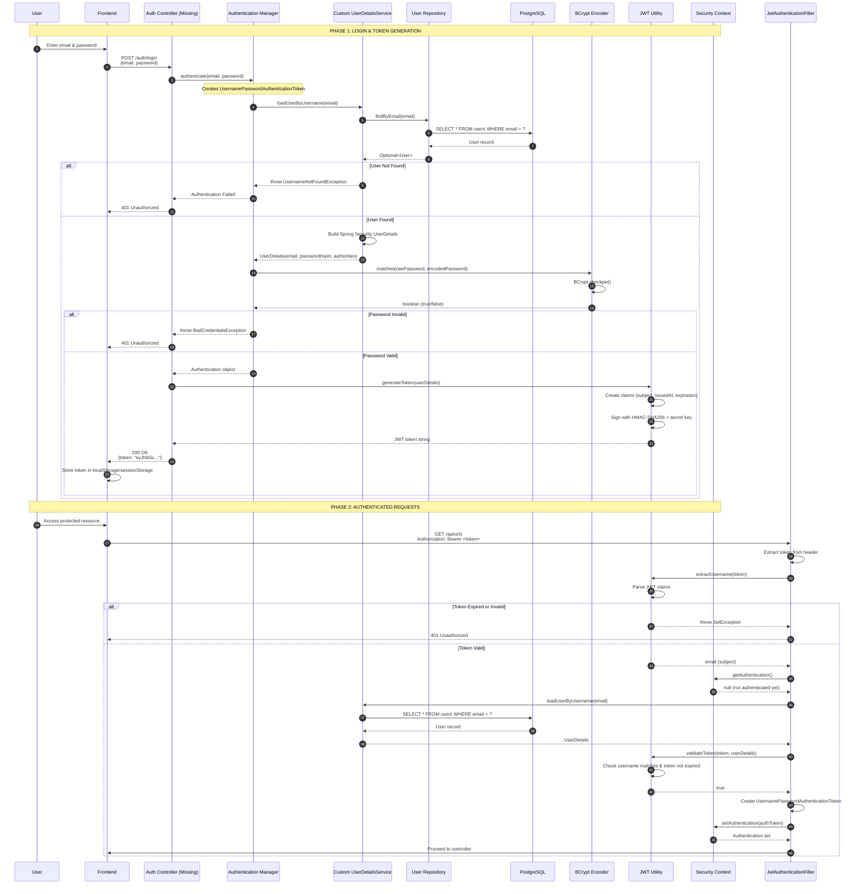
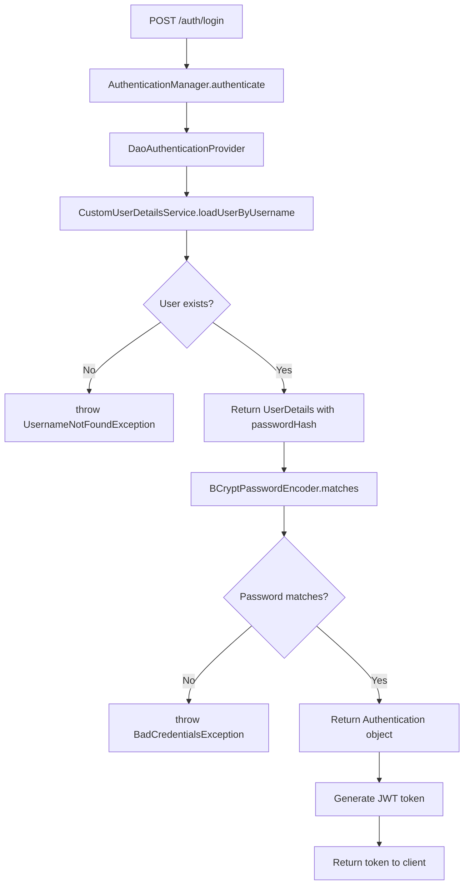

# Spring Boot URL Shortener - Security Deep Dive

## Table of Contents

1. [JWT Authentication Lifecycle](#1-jwt-authentication-lifecycle)
2. [Spring Security Configuration Line-by-Line](#2-spring-security-configuration-line-by-line)
3. [Password Hashing & Authentication Provider Flow](#3-password-hashing--authentication-provider-flow)
4. [Stateless Session Design](#4-stateless-session-design)
5. [Security Vulnerabilities & Risks](#5-security-vulnerabilities--risks)
6. [Production-Level Security Best Practices](#6-production-level-security-best-practices)

---

## 1. JWT Authentication Lifecycle

### 1.1 Complete Authentication Flow



### 1.2 Token Structure

**JWT Format:** `header.payload.signature`

**Example Token:**

```
eyJhbGciOiJIUzI1NiJ9.eyJzdWIiOiJ1c2VyQGV4YW1wbGUuY29tIiwiaWF0IjoxNzA3MzE4MDAwLCJleHAiOjE3MDc0MDQ0MDB9.signature
```

**Decoded Header:**

```json
{
  "alg": "HS256",
  "typ": "JWT"
}
```

**Decoded Payload:**

```json
{
  "sub": "user@example.com", // Subject (username/email)
  "iat": 1707318000, // Issued At (Unix timestamp)
  "exp": 1707404400 // Expiration (Unix timestamp)
}
```

**Signature:**

```
HMACSHA256(
  base64UrlEncode(header) + "." + base64UrlEncode(payload),
  secret_key
)
```

### 1.3 Token Generation Code Walkthrough

**File:** [JwtUtil.java](file:///d:/SpringbootMastery_projects/urlshortener/backend/src/main/java/com/example/url_shortener/security/JwtUtil.java)

```java
@Component
public class JwtUtil {

    @Value("${jwt.secret:default-test-secret-which-is-not-secure-but-ok-for-tests-please-change}")
    private String secret;

    @Value("${jwt.expiration:86400000}")
    private Long expiration; // 24 hours in milliseconds
```

> [!WARNING]
> **Security Risk:** The default secret is hardcoded and visible in source code. In production, this MUST be an environment variable.

**Token Generation:**

```java
public String generateToken(UserDetails userDetails) {
    Map<String, Object> claims = new HashMap<>();
    return createToken(claims, userDetails.getUsername());
}

private String createToken(Map<String, Object> claims, String subject) {
    Date now = new Date();
    Date expiryDate = new Date(now.getTime() + expiration);

    return Jwts.builder()
            .claims(claims)                    // Custom claims (currently empty)
            .subject(subject)                  // User identifier (email)
            .issuedAt(now)                     // Token creation time
            .expiration(expiryDate)            // Token expiration time
            .signWith(getSigningKey())         // HMAC-SHA256 signature
            .compact();                        // Serialize to string
}
```

**Signing Key Generation:**

```java
private SecretKey getSigningKey() {
    byte[] keyBytes = secret.getBytes(StandardCharsets.UTF_8);
    return Keys.hmacShaKeyFor(keyBytes);  // JJWT validates key length (min 256 bits)
}
```

> [!IMPORTANT]
> **Key Length Requirement:** HMAC-SHA256 requires a minimum 256-bit (32-byte) key. The secret in `application.yml` is 77 characters, which is sufficient.

### 1.4 Token Validation Code Walkthrough

**Extracting Claims:**

```java
public String extractUsername(String token) {
    return extractClaim(token, Claims::getSubject);
}

public Date extractExpiration(String token) {
    return extractClaim(token, Claims::getExpiration);
}

public <T> T extractClaim(String token, Function<Claims, T> claimsResolver) {
    final Claims claims = extractAllClaims(token);
    return claimsResolver.apply(claims);
}
```

**Parsing & Verifying Token:**

```java
private Claims extractAllClaims(String token) {
    return Jwts.parser()
            .verifyWith(getSigningKey())       // Verify signature
            .build()
            .parseSignedClaims(token)          // Parse and validate
            .getPayload();                     // Extract claims
}
```

**What Happens During Parsing:**

1. **Signature Verification:** Recomputes HMAC-SHA256 and compares with token signature
2. **Expiration Check:** Throws `ExpiredJwtException` if `exp < now`
3. **Format Validation:** Throws `MalformedJwtException` if invalid format
4. **Claim Extraction:** Returns claims if all checks pass

**Final Validation:**

```java
public Boolean validateToken(String token, UserDetails userDetails) {
    final String username = extractUsername(token);
    return (username.equals(userDetails.getUsername()) && !isTokenExpired(token));
}

private Boolean isTokenExpired(String token) {
    return extractExpiration(token).before(new Date());
}
```

**Validation Steps:**

1. Extract username from token
2. Compare with loaded user's username (prevents token reuse for different users)
3. Check token is not expired (redundant with parser check, but explicit)

### 1.5 Filter Chain Integration

**File:** [JwtAuthenticationFilter.java](file:///d:/SpringbootMastery_projects/urlshortener/backend/src/main/java/com/example/url_shortener/security/JwtAuthenticationFilter.java)

```java
@Component
@RequiredArgsConstructor
public class JwtAuthenticationFilter extends OncePerRequestFilter {

    private final JwtUtil jwtUtil;
    private final CustomUserDetailsService userDetailsService;
```

**Why `OncePerRequestFilter`?**

- Guarantees filter executes **exactly once per request**
- Prevents duplicate execution in forward/include scenarios
- Spring Security best practice for authentication filters

**Filter Logic:**

```java
@Override
protected void doFilterInternal(
        HttpServletRequest request,
        HttpServletResponse response,
        FilterChain filterChain) throws ServletException, IOException {

    // 1. Extract JWT token from Authorization header
    final String authHeader = request.getHeader("Authorization");
    final String jwt;
    final String userEmail;

    if (authHeader == null || !authHeader.startsWith("Bearer ")) {
        filterChain.doFilter(request, response);  // Skip authentication
        return;
    }

    jwt = authHeader.substring(7); // Remove "Bearer " prefix
    userEmail = jwtUtil.extractUsername(jwt);
```

**Why Skip If No Token?**

- Allows public endpoints (e.g., `/{shortCode}`) to work without authentication
- Spring Security will later check if endpoint requires authentication

```java
    // 2. If token contains username and user is not already authenticated
    if (userEmail != null && SecurityContextHolder.getContext().getAuthentication() == null) {
        UserDetails userDetails = this.userDetailsService.loadUserByUsername(userEmail);

        // 3. Validate token
        if (jwtUtil.validateToken(jwt, userDetails)) {
            UsernamePasswordAuthenticationToken authToken = new UsernamePasswordAuthenticationToken(
                    userDetails,
                    null,                          // Credentials (not needed after authentication)
                    userDetails.getAuthorities()); // Roles/permissions
            authToken.setDetails(new WebAuthenticationDetailsSource().buildDetails(request));

            // 4. Set authentication in SecurityContext
            SecurityContextHolder.getContext().setAuthentication(authToken);
        }
    }

    filterChain.doFilter(request, response);  // Continue to next filter
}
```

**Key Design Decisions:**

1. **Check Existing Authentication:** Avoids redundant database queries if user already authenticated
2. **Load User from DB:** Ensures user still exists and hasn't been disabled
3. **Set Authentication:** Makes user available to controllers via `@AuthenticationPrincipal`

---

## 2. Spring Security Configuration Line-by-Line

**File:** [SecurityConfig.java](file:///d:/SpringbootMastery_projects/urlshortener/backend/src/main/java/com/example/url_shortener/config/SecurityConfig.java)

### 2.1 Class-Level Configuration

```java
@Configuration
@EnableWebSecurity
@RequiredArgsConstructor
public class SecurityConfig {

    private final JwtAuthenticationFilter jwtAuthFilter;
    private final CustomUserDetailsService userDetailsService;
```

**Annotations Explained:**

- `@Configuration`: Marks this as a Spring configuration class
- `@EnableWebSecurity`: Activates Spring Security's web security support
- `@RequiredArgsConstructor`: Lombok generates constructor for dependency injection

### 2.2 Security Filter Chain

```java
@Bean
public SecurityFilterChain securityFilterChain(HttpSecurity http) throws Exception {
    http
            .csrf(csrf -> csrf.disable())
```

**CSRF Protection Disabled:**

✅ **Why It's Safe for JWT:**

- CSRF attacks require cookies (automatic browser inclusion)
- JWT in `Authorization` header requires explicit JavaScript inclusion
- Attacker cannot force victim's browser to include JWT in cross-origin requests

❌ **When It's NOT Safe:**

- If you store JWT in cookies (use `SameSite=Strict` + CSRF tokens)
- If you have session-based authentication alongside JWT

```java
            .authorizeHttpRequests(auth -> auth
                    // Public endpoints
                    .requestMatchers("/auth/**").permitAll()
                    .requestMatchers("/{shortCode}").permitAll() // Redirect endpoint

                    // All other endpoints require authentication
                    .anyRequest().authenticated())
```

**Authorization Rules:**

| Pattern        | Access        | Reason                     |
| -------------- | ------------- | -------------------------- |
| `/auth/**`     | Public        | Login/register endpoints   |
| `/{shortCode}` | Public        | Anyone can use short links |
| `/api/**`      | Authenticated | Protected resources        |

**Path Matching Order:**

- Spring Security processes rules **top to bottom**
- First match wins
- `anyRequest()` must be last (catch-all)

```java
            .sessionManagement(session -> session
                    .sessionCreationPolicy(SessionCreationPolicy.STATELESS))
```

**Stateless Session Policy:**

- **`STATELESS`:** Never create HTTP sessions
- **`ALWAYS`:** Always create sessions
- **`IF_REQUIRED`:** Create sessions only when needed (default)
- **`NEVER`:** Don't create, but use existing sessions

**Why Stateless for JWT?**

✅ **Horizontal Scalability:** No session affinity required
✅ **Microservices-Friendly:** No shared session store needed
✅ **Mobile-Friendly:** No cookie management

```java
            .authenticationProvider(authenticationProvider())
            .addFilterBefore(jwtAuthFilter, UsernamePasswordAuthenticationFilter.class);

    return http.build();
}
```

**Filter Chain Order:**

```
Request
  ↓
JwtAuthenticationFilter (custom)
  ↓
UsernamePasswordAuthenticationFilter (Spring default)
  ↓
FilterSecurityInterceptor (authorization)
  ↓
Controller
```

**Why Before `UsernamePasswordAuthenticationFilter`?**

- JWT filter sets authentication **before** Spring's default authentication filter
- Prevents Spring from looking for username/password in request

### 2.3 Authentication Provider

```java
@Bean
public AuthenticationProvider authenticationProvider() {
    DaoAuthenticationProvider authProvider = new DaoAuthenticationProvider(userDetailsService);
    authProvider.setPasswordEncoder(passwordEncoder());
    return authProvider;
}
```

**`DaoAuthenticationProvider` Responsibilities:**

1. Load user via `UserDetailsService`
2. Compare passwords using `PasswordEncoder`
3. Return authenticated `Authentication` object

**Why Constructor Injection?**

- Spring Boot 4.0.1 changed `DaoAuthenticationProvider` to require `UserDetailsService` in constructor
- Previous versions used setter injection: `authProvider.setUserDetailsService(userDetailsService)`

### 2.4 Password Encoder

```java
@Bean
public PasswordEncoder passwordEncoder() {
    return new BCryptPasswordEncoder();
}
```

**BCrypt Algorithm:**

- **Hash Function:** Blowfish cipher-based
- **Salt:** Automatically generated (random per password)
- **Cost Factor:** Default 10 (2^10 = 1024 rounds)
- **Output Format:** `$2a$10$salt(22 chars)hash(31 chars)`

**Example BCrypt Hash:**

```
$2a$10$N9qo8uLOickgx2ZMRZoMyeIjZAgcfl7p92ldGxad68LJZdL17lhWy
│  │  │                                                  │
│  │  └─ Salt (22 chars)                                └─ Hash (31 chars)
│  └─ Cost factor (10 = 2^10 rounds)
└─ Algorithm version (2a = BCrypt)
```

**Why BCrypt Over SHA-256?**

| Feature                      | BCrypt                 | SHA-256        |
| ---------------------------- | ---------------------- | -------------- |
| **Speed**                    | Slow (intentional)     | Fast           |
| **Salt**                     | Automatic              | Manual         |
| **Brute Force Resistance**   | High (adjustable cost) | Low            |
| **Rainbow Table Resistance** | High (salted)          | Low (unsalted) |

### 2.5 Authentication Manager

```java
@Bean
public AuthenticationManager authenticationManager(AuthenticationConfiguration config) throws Exception {
    return config.getAuthenticationManager();
}
```

**Why Expose as Bean?**

- Needed for manual authentication in login endpoint:

```java
@PostMapping("/auth/login")
public ResponseEntity<?> login(@RequestBody LoginRequest request) {
    Authentication authentication = authenticationManager.authenticate(
        new UsernamePasswordAuthenticationToken(request.getEmail(), request.getPassword())
    );
    // Generate JWT...
}
```

---

## 3. Password Hashing & Authentication Provider Flow

### 3.1 User Registration Flow

> [!CAUTION]
> **Missing Implementation:** The project lacks a registration endpoint. Here's how it should work:

```java
@PostMapping("/auth/register")
public ResponseEntity<?> register(@RequestBody RegisterRequest request) {
    // 1. Validate input
    if (userRepository.existsByEmail(request.getEmail())) {
        return ResponseEntity.badRequest().body("Email already exists");
    }

    // 2. Hash password
    String hashedPassword = passwordEncoder.encode(request.getPassword());

    // 3. Create user
    User user = User.builder()
            .email(request.getEmail())
            .passwordHash(hashedPassword)  // Store hashed password
            .role("USER")
            .build();

    userRepository.save(user);

    return ResponseEntity.ok("User registered successfully");
}
```

**Password Hashing Process:**

```
Raw Password: "MySecurePassword123"
         ↓
BCryptPasswordEncoder.encode()
         ↓
Generate random salt: "N9qo8uLOickgx2ZMRZoMye"
         ↓
Hash with Blowfish: 2^10 rounds
         ↓
Stored Hash: "$2a$10$N9qo8uLOickgx2ZMRZoMyeIjZAgcfl7p92ldGxad68LJZdL17lhWy"
```

### 3.2 Login Authentication Flow

**Step-by-Step Process:**



**CustomUserDetailsService Implementation:**

**File:** [CustomUserDetailsService.java](file:///d:/SpringbootMastery_projects/urlshortener/backend/src/main/java/com/example/url_shortener/security/CustomUserDetailsService.java)

```java
@Service
@RequiredArgsConstructor
public class CustomUserDetailsService implements UserDetailsService {

    private final UserRepository userRepository;

    @Override
    public UserDetails loadUserByUsername(String email) throws UsernameNotFoundException {
        User user = userRepository.findByEmail(email)
                .orElseThrow(() -> new UsernameNotFoundException("User not found with email: " + email));

        return new org.springframework.security.core.userdetails.User(
                user.getEmail(),                                              // Username
                user.getPasswordHash(),                                       // Password
                Collections.singletonList(new SimpleGrantedAuthority("ROLE_" + user.getRole()))  // Authorities
        );
    }
}
```

**Why "ROLE\_" Prefix?**

- Spring Security convention for role-based authorization
- Allows using `@PreAuthorize("hasRole('USER')")` without prefix
- Internally, Spring adds "ROLE\_" prefix when checking

### 3.3 Password Verification Deep Dive

**BCrypt Matching Process:**

```java
public boolean matches(CharSequence rawPassword, String encodedPassword) {
    // 1. Extract salt from stored hash
    String salt = encodedPassword.substring(0, 29);  // "$2a$10$" + 22-char salt

    // 2. Hash raw password with extracted salt
    String hashedInput = BCrypt.hashpw(rawPassword.toString(), salt);

    // 3. Constant-time comparison (prevents timing attacks)
    return BCrypt.equalsNoEarlyReturn(hashedInput, encodedPassword);
}
```

**Why Constant-Time Comparison?**

❌ **Vulnerable (Early Return):**

```java
for (int i = 0; i < hash1.length; i++) {
    if (hash1[i] != hash2[i]) return false;  // Returns immediately on mismatch
}
```

✅ **Secure (Constant-Time):**

```java
int result = 0;
for (int i = 0; i < hash1.length; i++) {
    result |= hash1[i] ^ hash2[i];  // Always checks all characters
}
return result == 0;
```

**Timing Attack Example:**

- Attacker measures response time
- Faster response = earlier mismatch = fewer correct characters
- Can brute-force password character by character

---

## 4. Stateless Session Design

### 4.1 Traditional Session-Based Authentication

**How It Works:**

```
Client                    Server
  │                         │
  ├─ POST /login ──────────>│
  │                         ├─ Validate credentials
  │                         ├─ Create session
  │                         ├─ Store in memory/Redis
  │<─ Set-Cookie: JSESSIONID=abc123
  │                         │
  ├─ GET /api/urls ────────>│
  │   Cookie: JSESSIONID    │
  │                         ├─ Lookup session by ID
  │                         ├─ Retrieve user from session
  │<─ 200 OK ───────────────┤
```

**Problems:**

❌ **Server-Side State:** Requires session storage (memory/Redis)
❌ **Scalability:** Sticky sessions or shared session store needed
❌ **CSRF Vulnerable:** Cookies automatically included in requests

### 4.2 JWT Stateless Authentication

**How It Works:**

```
Client                    Server
  │                         │
  ├─ POST /login ──────────>│
  │                         ├─ Validate credentials
  │                         ├─ Generate JWT (no storage)
  │<─ {token: "eyJhbGc..."} ┤
  │                         │
  ├─ Store in localStorage  │
  │                         │
  ├─ GET /api/urls ────────>│
  │   Authorization: Bearer <token>
  │                         ├─ Verify JWT signature
  │                         ├─ Extract user from token
  │<─ 200 OK ───────────────┤
```

**Advantages:**

✅ **No Server State:** Token contains all user info
✅ **Horizontal Scaling:** Any server can validate token
✅ **Microservices-Friendly:** Share secret across services
✅ **Mobile-Friendly:** No cookie management

### 4.3 Stateless Configuration in Code

**application.yml:**

```yaml
spring:
  jpa:
    hibernate:
      ddl-auto: validate # Don't auto-create schema (Flyway handles it)
```

**SecurityConfig.java:**

```java
.sessionManagement(session -> session
    .sessionCreationPolicy(SessionCreationPolicy.STATELESS))
```

**What This Prevents:**

1. **No `HttpSession` Creation:** `request.getSession()` returns null
2. **No `JSESSIONID` Cookie:** No session cookie sent to client
3. **No Session Fixation Attacks:** No sessions to hijack

### 4.4 Trade-offs of Stateless Design

**Pros:**

✅ **Scalability:** No session affinity required
✅ **Performance:** No session lookup overhead
✅ **Simplicity:** No session cleanup/expiration logic

**Cons:**

❌ **Token Revocation:** Can't invalidate tokens before expiration
❌ **Token Size:** Larger than session IDs (sent on every request)
❌ **Secret Management:** Compromised secret invalidates all tokens

**Mitigation Strategies:**

1. **Short Expiration:** 15-minute access tokens + refresh tokens
2. **Token Blacklist:** Store revoked tokens in Redis (defeats stateless purpose)
3. **Token Versioning:** Include version in claims, increment on password change

---

## 5. Security Vulnerabilities & Risks

### 5.1 Critical Vulnerabilities

#### 🔴 **1. Missing Authorization Checks**

**Location:** [UrlController.java](file:///d:/SpringbootMastery_projects/urlshortener/backend/src/main/java/com/example/url_shortener/controller/UrlController.java)

**Vulnerable Code:**

```java
@GetMapping
public ResponseEntity<List<ShortUrlDTOResponse>> getAllShortUrls() {
    return new ResponseEntity<>(urlService.getAllShortUrls(), HttpStatus.OK);
}
```

**Exploit:**

- Any authenticated user can see **all URLs** in the database
- Violates principle of least privilege

**Fix:**

```java
@GetMapping
public ResponseEntity<List<ShortUrlDTOResponse>> getAllShortUrls(Authentication authentication) {
    String userEmail = authentication.getName();
    return ResponseEntity.ok(urlService.getUrlsByUser(userEmail));
}
```

#### 🔴 **2. Insecure Direct Object Reference (IDOR)**

**Vulnerable Code:**

```java
@DeleteMapping("/{id}")
public ResponseEntity<Void> deleteShortUrl(@PathVariable UUID id) {
    urlService.deleteUrl(id);
    return ResponseEntity.noContent().build();
}
```

**Exploit:**

- User A can delete User B's URLs by guessing UUIDs
- No ownership verification

**Fix:**

```java
@DeleteMapping("/{id}")
public ResponseEntity<Void> deleteShortUrl(@PathVariable UUID id, Authentication authentication) {
    String userEmail = authentication.getName();
    urlService.deleteUrl(id, userEmail);  // Verify ownership in service
    return ResponseEntity.noContent().build();
}

// In UrlService:
public void deleteUrl(UUID id, String ownerEmail) {
    ShortUrl url = shortUrlRepository.findById(id)
            .orElseThrow(() -> new ShortUrlNotFoundException("URL not found"));

    if (!url.getUser().getEmail().equals(ownerEmail)) {
        throw new AccessDeniedException("You don't own this URL");
    }

    shortUrlRepository.delete(url);
}
```

#### 🔴 **3. Hardcoded JWT Secret**

**Location:** [application.yml](file:///d:/SpringbootMastery_projects/urlshortener/backend/src/main/resources/application.yml)

**Vulnerable Code:**

```yaml
jwt:
  secret: ${JWT_SECRET:your-256-bit-secret-key-change-this-in-production-minimum-32-characters-required}
```

**Risks:**

- Default secret is visible in source code
- If committed to Git, secret is public
- Attacker can forge tokens with known secret

**Fix:**

```yaml
jwt:
  secret: ${JWT_SECRET} # No default, fail fast if not set
```

**Environment Variable:**

```bash
export JWT_SECRET=$(openssl rand -base64 32)
```

#### 🔴 **4. Missing Input Validation**

**Vulnerable Code:**

```java
@PostMapping
public ResponseEntity<ShortUrlDTOResponse> createShortUrl(@RequestBody ShortUrlDTORequest request) {
    // No validation!
    ShortUrlDTOResponse response = urlService.createShortUrl(request);
    return new ResponseEntity<>(response, HttpStatus.CREATED);
}
```

**Exploits:**

- Empty URL: `{"originalUrl": ""}`
- Invalid URL: `{"originalUrl": "not-a-url"}`
- XSS payload: `{"originalUrl": "javascript:alert('XSS')"}`
- SQL injection (mitigated by JPA, but still bad practice)

**Fix:**

```java
public class ShortUrlDTORequest {
    @NotBlank(message = "URL cannot be blank")
    @URL(message = "Invalid URL format")
    @Size(max = 2048, message = "URL too long")
    private String originalUrl;
}

@PostMapping
public ResponseEntity<ShortUrlDTOResponse> createShortUrl(@Valid @RequestBody ShortUrlDTORequest request) {
    // Spring validates automatically
}
```

### 5.2 High-Risk Vulnerabilities

#### 🟠 **5. No Rate Limiting**

**Risk:**

- Attacker can brute-force login
- Attacker can enumerate short codes
- DDoS via URL creation

**Fix (Bucket4j):**

```java
@Component
public class RateLimitingFilter extends OncePerRequestFilter {

    private final Bucket bucket = Bucket.builder()
            .addLimit(Bandwidth.simple(100, Duration.ofMinutes(1)))
            .build();

    @Override
    protected void doFilterInternal(HttpServletRequest request, HttpServletResponse response, FilterChain filterChain) {
        if (bucket.tryConsume(1)) {
            filterChain.doFilter(request, response);
        } else {
            response.setStatus(429);  // Too Many Requests
        }
    }
}
```

#### 🟠 **6. Exposed Database Credentials**

**Location:** [application.yml](file:///d:/SpringbootMastery_projects/urlshortener/backend/src/main/resources/application.yml)

**Vulnerable Code:**

```yaml
datasource:
  url: jdbc:postgresql://localhost:5432/url_shortener
  username: postgres
  password: pardhasaradhi # Hardcoded password!
```

**Fix:**

```yaml
datasource:
  url: ${DATABASE_URL}
  username: ${DATABASE_USERNAME}
  password: ${DATABASE_PASSWORD}
```

#### 🟠 **7. No HTTPS Enforcement**

**Risk:**

- JWT tokens sent over HTTP can be intercepted
- Man-in-the-middle attacks

**Fix:**

```yaml
server:
  ssl:
    enabled: true
    key-store: classpath:keystore.p12
    key-store-password: ${KEYSTORE_PASSWORD}
    key-store-type: PKCS12
```

**Force HTTPS Redirect:**

```java
http.requiresChannel(channel -> channel
    .anyRequest().requiresSecure());
```

### 5.3 Medium-Risk Vulnerabilities

#### 🟡 **8. CORS Misconfiguration**

**Location:** [WebConfig.java](file:///d:/SpringbootMastery_projects/urlshortener/backend/src/main/java/com/example/url_shortener/config/WebConfig.java)

**Vulnerable Code:**

```java
registry.addMapping("/**")
        .allowedOrigins("http://localhost:5173")
        .allowedMethods("*");  // Allows all HTTP methods
```

**Risks:**

- Allows DELETE, PUT from frontend (intended)
- But `allowedMethods("*")` is overly permissive

**Fix:**

```java
registry.addMapping("/**")
        .allowedOrigins(getAllowedOrigins())  // Environment-based
        .allowedMethods("GET", "POST", "PUT", "DELETE")
        .allowedHeaders("Authorization", "Content-Type")
        .exposedHeaders("Authorization")
        .allowCredentials(false)  // Don't allow cookies with CORS
        .maxAge(3600);

private String[] getAllowedOrigins() {
    String origins = System.getenv("ALLOWED_ORIGINS");
    return origins != null ? origins.split(",") : new String[]{"http://localhost:5173"};
}
```

#### 🟡 **9. No Logging of Security Events**

**Missing:**

- Failed login attempts
- Token validation failures
- Authorization failures

**Fix:**

```java
@Slf4j
public class JwtAuthenticationFilter extends OncePerRequestFilter {

    @Override
    protected void doFilterInternal(...) {
        try {
            // Existing logic
        } catch (ExpiredJwtException e) {
            log.warn("Expired JWT token for IP: {}", request.getRemoteAddr());
        } catch (MalformedJwtException e) {
            log.error("Malformed JWT token from IP: {}", request.getRemoteAddr());
        }
    }
}
```

#### 🟡 **10. No Account Lockout**

**Risk:**

- Unlimited login attempts
- Brute-force attacks

**Fix:**

```java
@Service
public class LoginAttemptService {

    private final LoadingCache<String, Integer> attemptsCache = CacheBuilder.newBuilder()
            .expireAfterWrite(1, TimeUnit.HOURS)
            .build(new CacheLoader<>() {
                public Integer load(String key) {
                    return 0;
                }
            });

    public void loginFailed(String email) {
        int attempts = attemptsCache.get(email);
        attemptsCache.put(email, attempts + 1);
    }

    public boolean isBlocked(String email) {
        return attemptsCache.get(email) >= 5;
    }
}
```

### 5.4 Vulnerability Summary Table

| Severity    | Vulnerability         | Impact | Exploitability | Priority |
| ----------- | --------------------- | ------ | -------------- | -------- |
| 🔴 Critical | Missing Authorization | High   | Easy           | 1        |
| 🔴 Critical | IDOR                  | High   | Easy           | 1        |
| 🔴 Critical | Hardcoded Secret      | High   | Medium         | 1        |
| 🔴 Critical | No Input Validation   | High   | Easy           | 2        |
| 🟠 High     | No Rate Limiting      | Medium | Easy           | 3        |
| 🟠 High     | Exposed Credentials   | High   | Easy           | 1        |
| 🟠 High     | No HTTPS              | High   | Medium         | 2        |
| 🟡 Medium   | CORS Misconfiguration | Low    | Medium         | 4        |
| 🟡 Medium   | No Security Logging   | Low    | N/A            | 5        |
| 🟡 Medium   | No Account Lockout    | Medium | Easy           | 4        |

---

## 6. Production-Level Security Best Practices

### 6.1 Secrets Management

**❌ Never Do This:**

```yaml
jwt:
  secret: my-secret-key
database:
  password: admin123
```

**✅ Use Environment Variables:**

```yaml
jwt:
  secret: ${JWT_SECRET}
database:
  password: ${DB_PASSWORD}
```

**✅ Use Secrets Manager (AWS/GCP/Azure):**

```java
@Configuration
public class SecretsConfig {

    @Bean
    public String jwtSecret() {
        // AWS Secrets Manager
        return awsSecretsManager.getSecretValue("prod/jwt-secret");
    }
}
```

**✅ Use Vault (HashiCorp):**

```bash
vault kv get secret/url-shortener/jwt-secret
```

### 6.2 JWT Best Practices

**1. Short Expiration Times:**

```yaml
jwt:
  access-token-expiration: 900000 # 15 minutes
  refresh-token-expiration: 604800000 # 7 days
```

**2. Refresh Token Pattern:**

```java
public class TokenResponse {
    private String accessToken;   // Short-lived (15 min)
    private String refreshToken;  // Long-lived (7 days)
}

@PostMapping("/auth/refresh")
public ResponseEntity<?> refresh(@RequestBody RefreshTokenRequest request) {
    String newAccessToken = jwtUtil.refreshAccessToken(request.getRefreshToken());
    return ResponseEntity.ok(new TokenResponse(newAccessToken, request.getRefreshToken()));
}
```

**3. Token Claims:**

```java
Map<String, Object> claims = new HashMap<>();
claims.put("userId", user.getId());
claims.put("role", user.getRole());
claims.put("tokenVersion", user.getTokenVersion());  // Increment on password change
```

**4. Secure Token Storage (Frontend):**

```javascript
// ❌ Bad: localStorage (vulnerable to XSS)
localStorage.setItem('token', token);

// ✅ Better: httpOnly cookie (backend sets)
response.addCookie(new Cookie("refreshToken", token) {{
    setHttpOnly(true);
    setSecure(true);
    setSameSite("Strict");
}});

// ✅ Best: Memory + refresh token in httpOnly cookie
const [accessToken, setAccessToken] = useState(null);  // In-memory
```

### 6.3 Password Security

**1. Strong Password Policy:**

```java
@Pattern(regexp = "^(?=.*[a-z])(?=.*[A-Z])(?=.*\\d)(?=.*[@$!%*?&])[A-Za-z\\d@$!%*?&]{8,}$",
         message = "Password must contain uppercase, lowercase, digit, special char, min 8 chars")
private String password;
```

**2. Password Breach Detection:**

```java
public boolean isPasswordCompromised(String password) {
    String sha1 = DigestUtils.sha1Hex(password);
    String prefix = sha1.substring(0, 5);
    String suffix = sha1.substring(5);

    // Check against Have I Been Pwned API
    String response = restTemplate.getForObject(
        "https://api.pwnedpasswords.com/range/" + prefix, String.class);

    return response.contains(suffix.toUpperCase());
}
```

**3. BCrypt Cost Factor:**

```java
@Bean
public PasswordEncoder passwordEncoder() {
    return new BCryptPasswordEncoder(12);  // Increase cost over time
}
```

### 6.4 HTTPS & TLS

**1. Force HTTPS:**

```java
http.requiresChannel(channel -> channel
    .anyRequest().requiresSecure());
```

**2. HSTS Header:**

```java
http.headers(headers -> headers
    .httpStrictTransportSecurity(hsts -> hsts
        .maxAgeInSeconds(31536000)  // 1 year
        .includeSubDomains(true)
        .preload(true)));
```

**3. TLS Configuration:**

```yaml
server:
  ssl:
    enabled: true
    protocol: TLS
    enabled-protocols: TLSv1.3,TLSv1.2
    ciphers: TLS_AES_128_GCM_SHA256,TLS_AES_256_GCM_SHA384
```

### 6.5 Security Headers

```java
http.headers(headers -> headers
    .contentSecurityPolicy(csp -> csp
        .policyDirectives("default-src 'self'; script-src 'self' 'unsafe-inline'"))
    .xssProtection(xss -> xss.headerValue(XXssProtectionHeaderWriter.HeaderValue.ENABLED_MODE_BLOCK))
    .frameOptions(frame -> frame.deny())
    .contentTypeOptions(Customizer.withDefaults())
    .referrerPolicy(referrer -> referrer.policy(ReferrerPolicyHeaderWriter.ReferrerPolicy.STRICT_ORIGIN_WHEN_CROSS_ORIGIN)));
```

**Headers Explained:**

| Header                    | Value                             | Purpose                                     |
| ------------------------- | --------------------------------- | ------------------------------------------- |
| `Content-Security-Policy` | `default-src 'self'`              | Prevent XSS by restricting resource sources |
| `X-XSS-Protection`        | `1; mode=block`                   | Enable browser XSS filter                   |
| `X-Frame-Options`         | `DENY`                            | Prevent clickjacking                        |
| `X-Content-Type-Options`  | `nosniff`                         | Prevent MIME sniffing                       |
| `Referrer-Policy`         | `strict-origin-when-cross-origin` | Control referrer information                |

### 6.6 Database Security

**1. Principle of Least Privilege:**

```sql
-- Create dedicated app user
CREATE USER url_shortener_app WITH PASSWORD 'strong-password';

-- Grant only necessary permissions
GRANT SELECT, INSERT, UPDATE, DELETE ON short_urls TO url_shortener_app;
GRANT SELECT, INSERT, UPDATE, DELETE ON users TO url_shortener_app;
GRANT SELECT, INSERT ON click_events TO url_shortener_app;  -- No UPDATE/DELETE

-- Revoke dangerous permissions
REVOKE CREATE, DROP ON DATABASE url_shortener FROM url_shortener_app;
```

**2. Connection Pooling:**

```yaml
spring:
  datasource:
    hikari:
      maximum-pool-size: 10
      minimum-idle: 5
      connection-timeout: 30000
      idle-timeout: 600000
      max-lifetime: 1800000
```

**3. SQL Injection Prevention:**

```java
// ✅ Safe: Parameterized queries (JPA default)
@Query("SELECT s FROM ShortUrl s WHERE s.shortCode = :code")
Optional<ShortUrl> findByShortCode(@Param("code") String code);

// ❌ Dangerous: String concatenation
@Query("SELECT s FROM ShortUrl s WHERE s.shortCode = '" + code + "'")  // NEVER DO THIS
```

### 6.7 Monitoring & Alerting

**1. Security Event Logging:**

```java
@Slf4j
@Component
public class SecurityEventLogger {

    @EventListener
    public void onAuthenticationSuccess(AuthenticationSuccessEvent event) {
        log.info("Login success: user={}, ip={}",
            event.getAuthentication().getName(),
            getClientIP());
    }

    @EventListener
    public void onAuthenticationFailure(AuthenticationFailureBadCredentialsEvent event) {
        log.warn("Login failed: user={}, ip={}",
            event.getAuthentication().getName(),
            getClientIP());
    }
}
```

**2. Metrics (Micrometer):**

```java
@Timed(value = "auth.login", description = "Login attempts")
public Authentication login(String email, String password) {
    // ...
}
```

**3. Alerts (Prometheus):**

```yaml
groups:
  - name: security
    rules:
      - alert: HighFailedLoginRate
        expr: rate(auth_login_failures[5m]) > 10
        annotations:
          summary: "High failed login rate detected"
```

### 6.8 Dependency Security

**1. Dependency Scanning:**

```bash
mvn dependency-check:check
```

**2. Automated Updates:**

```xml
<plugin>
    <groupId>org.codehaus.mojo</groupId>
    <artifactId>versions-maven-plugin</artifactId>
    <version>2.16.0</version>
</plugin>
```

**3. OWASP Dependency-Check:**

```xml
<plugin>
    <groupId>org.owasp</groupId>
    <artifactId>dependency-check-maven</artifactId>
    <version>8.4.0</version>
</plugin>
```

### 6.9 Security Checklist

**Pre-Production:**

- [ ] All secrets in environment variables
- [ ] HTTPS enforced
- [ ] HSTS enabled
- [ ] Security headers configured
- [ ] Input validation on all endpoints
- [ ] Authorization checks on all protected endpoints
- [ ] Rate limiting implemented
- [ ] Account lockout after failed attempts
- [ ] Password policy enforced
- [ ] JWT expiration < 1 hour
- [ ] Refresh token rotation
- [ ] CORS restricted to production domains
- [ ] Database credentials rotated
- [ ] Dependency vulnerabilities scanned
- [ ] Security logging enabled
- [ ] Monitoring & alerting configured

**Post-Production:**

- [ ] Regular security audits
- [ ] Penetration testing
- [ ] Log analysis
- [ ] Incident response plan
- [ ] Backup & disaster recovery
- [ ] Security training for team

---

## Conclusion

This URL shortener demonstrates **solid security fundamentals** but has **critical gaps** that must be addressed before production:

**Strengths:**
✅ JWT authentication
✅ BCrypt password hashing
✅ Stateless session design
✅ CSRF protection (disabled safely)

**Critical Fixes Needed:**
🔴 Add authorization checks
🔴 Fix IDOR vulnerabilities
🔴 Move secrets to environment variables
🔴 Add input validation
🔴 Implement rate limiting

**With these improvements, this becomes a production-ready, secure backend that demonstrates professional-level security awareness.**

---

**Document Version:** 1.0  
**Last Updated:** 2026-02-07  
**Security Review Date:** 2026-02-07
